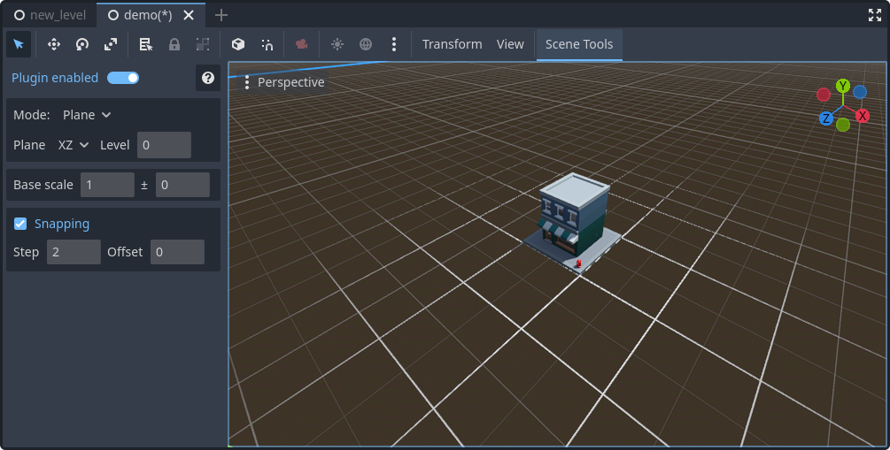

# Scene Tools
Scene Tools is an editor plugin for Godot 4.2+ to help you with editing your 3D levels and quick prototyping. It currently only supports asset placement.

The plugin supports any PackedScene files (.tscn, .gltf, .blend, etc).

## Currently implemented features
* Asset placement
  * Snapping support
  * Align to surface
  * Multiple assets selection (by holding Ctrl or Shift). When placing, random asset will be picked from the selection
  * Scale, rotation randomization
  * Area fill

## Installation
The plugin is available in the [Asset Library](https://godotengine.org/asset-library/asset/2846).

Follow [Godot documentation](https://docs.godotengine.org/en/stable/tutorials/plugins/editor/installing_plugins.html) on how to install and enable plugins.

> [!WARNING]
If you are using Godot 4.2, make sure to restart the editor after installing the plugin.

## How to use
1. After enabling the plugin, open the "Collections" tab at the bottom of the window.
2. First, you will have to create a collection. Click "File", select "New collection", enter its name and click "Create"
3. Save the file somewhere in your project.
4. Drag and drop your assets into empty space. 
5. Select the asset you want to place from the list. Right click if you want to remove it from the collection.
6. Select any node in the scene tree. Objects will be spawned as children of this node.

You should now be able to place the asset.

## License
This plugin is licensed under the [MIT License](https://github.com/fstxz/scene_tools/blob/master/LICENSE.txt).
